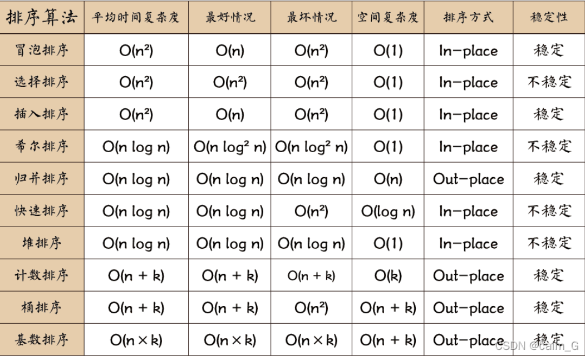

## 排序算法

**图片仅作参考，并不完全正确**

**1.选择排序**

对于已排序好的部分`[0..i]`，选择该部分右端点`i`，从该点后开始寻找子区间`[i+1..n-1]`内的最小/大值，和该点进行交换，排序好的部分+1，然后循环直到序列全部排序完。

时间复杂度：最坏情况：`O(N^2)`
      最好情况：`O(N^2)`
空间复杂度：`O(1)`

**2.冒泡排序**

对于每一次遍历循环，比较相邻两端点的大小并交换，共n-1次

时间复杂度：最坏情况：`O(N^2)`
      最好情况：`O(N)`
空间复杂度：`O(1)`

**3.插入排序**

(类比打牌给牌排序)

1.从第一个元素开始，该元素可以认为已经被排序
2.取下一个元素`tem`，从已排序的元素序列从后往前扫描
3.如果该元素大/小于`tem`，则将该元素移到下一位
4.重复步骤3，直到找到已排序元素中小于等于`tem`的元素
5.`tem`插入到该元素的后面，如果已排序所有元素都大于`tem`，则将`tem`插入到下标为0的位置
6.重复步骤2~5

时间复杂度：最坏情况下为`O(N*N)`，此时待排序列为逆序，或者说接近逆序
      最好情况下为`O(N)`，此时待排序列为升序，或者说接近升序。
空间复杂度：`O(1)`

**4.希尔排序**

选定增量，使得序列内以该增量为距离的所有元素为一组，对每组进行插入排序，每次增量减少，直到增量为1后对整个序列进行插入排序

先将待排序列进行预排序，使待排序列接近有序，然后再对该序列进行一次插入排序，此时插入排序的时间复杂度为`O(N)`，

时间复杂度：随增量的变化而变化，不同增量的复杂度差异较大，平均时间复杂度大致为`O(n^1.3)`

**5.堆排序**

1. 把无序数组构建成二叉堆。
2. 循环删除堆顶元素，移到集合尾部，调节堆产生新的堆顶。

堆排序是不稳定的排序，空间复杂度为`O(1)`,平均的时间复杂度为`O(nlogn)`,最坏情况下也稳定在`O(nlogn)`

**6.快速排序**

通过一趟排序将要排序的数据分割成独立的两部分，其中一部分的所有数据都比另外一部分的所有数据都要小，然后再按此方法对这两部分数据分别进行快速排序，整个排序过程可以递归进行，以此达到整个数据变成有序序列。

快速排序算法通过多次比较和交换来实现排序，其排序流程如下：

1、首先设定一个分界值，通过该分界值将数组分成左右两部分。

2、将大于或等于分界值的数据集中到数组右边，小于分界值的数据集中到数组的左边。此时，左边部分中各元素都小于或等于分界值，而右边部分中各元素都大于或等于分界值。

3、然后，左边和右边的数据可以独立排序。对于左侧的数组数据，又可以取一个分界值，将该部分数据分成左右两部分，同样在左边放置较小值，右边放置较大值。右侧的数组数据也可以做类似处理。

4、重复上述过程，可以看出，这是一个递归定义。通过递归将左侧部分排好序后，再递归排好右侧部分的顺序。当左、右两个部分各数据排序完成后，整个数组的排序也就完成了。

概括来说为 挖坑填数 + 分治法。

时间复杂度：

理想情况：每次都把数组都分成平均的两个部分，如果按照这样的理想情况分下去，最终能得到一个完全二叉树，则复杂度`O(nlog n)`

而在最坏的情况下，这个树是一个完全的斜树，只有左半边或者右半边。这时候比较次数就变为`O(N^2)`

**7.归并排序**

归并排序（Merge sort）是建立在归并操作上的一种有效的排序算法，该算法是采用分治法的一个非常典型的应用。将已有序的子序列合并，得到完全有序的序列；即先使每个子序列有序，再使子序列段间有序。

归并排序算法有两个基本的操作，一个是分，也就是把原数组划分成两个子数组的过程。另一个是治，它将两个有序数组合并成一个更大的有序数组。

将待排序的线性表不断地切分成若干个子表，直到每个子表只包含一个元素，这时，可以认为只包含一个元素的子表是有序表。
将子表两两合并（合并时两个字表元素进行比较排序），每合并一次，就会产生一个新的且更长的有序表，重复这一步骤，直到最后只剩下一个子表，这个子表就是排好序的线性表。

时间复杂度：每一次都要执行n次，一共有`log n`层，则`O(nlogn)`

**8.桶排序**

把待排序的数尽量均匀地放到各个桶中，再对各个桶进行局部的排序，最后再按序将各个桶中的数输出，即可得到排好序的数

首先确定桶的个数。因为桶排序最好是将数据均匀地分散在各个桶中，那么桶的个数最好是应该根据数据的分散情况来确定。首先找出所有数据中的最大值mx和最小值`mn`；

根据`mx`和`mn`确定每个桶所装的数据的范围 size，有`size = (mx - mn) / n + 1`，n为数据的个数,需要保证每个桶至少要能装1个数,故而需要加个1；

求得了`size`即知道了每个桶所装数据的范围，还需要计算出所需的桶的个数`cnt`，有`cnt = (mx - mn) / size + 1`，需要保证至少有一个桶，故而需要加个1；

求得了`size`和`cnt`后，即可知第一个桶装的数据范围为` [mn, mn + size)`，第二个桶为 `[mn + size, mn + 2 * size)`，…，以此类推
因此步骤2中需要再扫描一遍数组，将待排序的各个数放进对应的桶中。

对各个桶中的数据进行排序，可以使用其他的排序算法排序，例如快速排序；也可以递归使用桶排序进行排序；

将各个桶中排好序的数据依次输出，最后得到的数据即为最终有序。

时间复杂度：

最好情况：`O(n+k)`，k为桶的数量，当数据是均匀分散排列的，那么每个桶分到的数据个数都是一样的，这一步复杂度`O(k)`在对每个桶进行排序的时候，最好情况下是数据都已经是有序的了，那么最好的排序算法的时间复杂度会是`O(n)`,总共`O(n+k)`

最坏情况：当对每个桶中的数据进行排序的时候，所使用的排序算法，最坏情况下是`O(n^2)`，因此总的最坏情况下的时间复杂度为`O(n^2）`

平均情况：`O(n + n²/k + k)` <=> `O(n)`，如果k是根据Θ(n)来获取的，那么平均时间复杂度就是 `O(n)`

**9.基数排序**

非比较排序算法，按照低位先排序，然后收集；再按照高位排序，然后再收集；依次类推，直到最高位。有时候有些属性是有优先级顺序的，先按低优先级排序，再按高优先级排序。最后的次序就是高优先级高的在前，高优先级相同的低优先级高的在前。基数排序基于分别排序，分别收集，所以是稳定的

步骤：

- 取得数组中的最大数，并取得位数；
- arr为原始数组，从最低位开始取每个位组成radix数组；
- 对radix进行计数排序（利用计数排序适用于小范围数的特点）

时间复杂度：`O(n*k)`，k为位数
